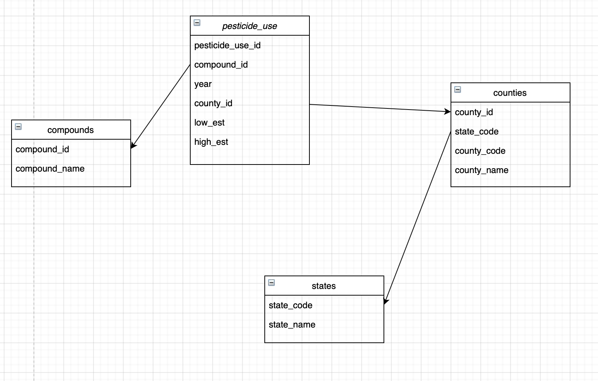
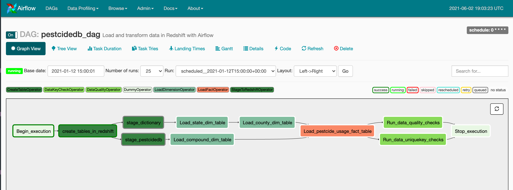
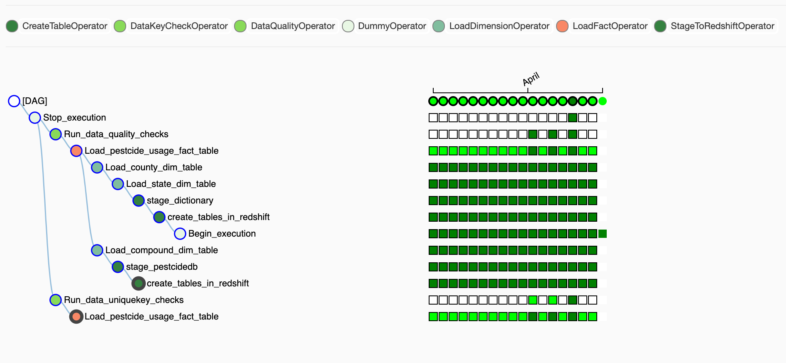

Data Engineering Capstone Project
----

# Project Summary

The objective of this project was to create an ETL pipeline for pestcide usage by county and year in the United States to form an analytics database on pestcide usage. The tools we are going to use here are Amazon S3, Amazon Redshift, Apache Airflow, Jupyter Notebook. We are using two dataset. One is the dataset of pestcide usage based on year and location. The other is the dataset of locations. At the end of DAG, we will check the data quality by checking the count of data and checking the data types are correct in each table and column.

We will read, parse and clean the data from local, Amazon S3 and transfer the data to redshift tables in AWS. We will orchestrate the data flow through Apache Airflow DAGs.

# Data and Code

* **data/** - the sample data of pestcide usage by year and county dictionary data
* **etl.ipynb** - the Jupyter notebook to explore the dataset
* **airflow/dags/dag.py** - The dag of Airflow
* **airflow/plugins/helpers** - sql queries for insert data to tables
* **airflow/plugins/operators** - operators for Airflow dag

# ETL Flow

* Colloct data from S3
* Load pestcide data and county data to Redshift staging tables
* Perform the load fact operators and load dimension operators to update the fact and dimension tables.
* Airflow DAG runs the data quality check on all tables

# Data Model

We are using relational database in Redshift with Postgresql. The reason we use relational database is the data in dictionary and pestcide usage are structured and table based.

# DAG Views:

# Airflow Tree Views:

# How to run

### 1. Run the Jupyter notebook to explore the dataset

1.1 Install postgresql, psql, jupyter notebook and other required python packages;

1.2 Run create_table.py;

1.3 Run jupyter-lab and work on the etl.ipynb.

### 2. Run the Airflow

1.1 Create the Redshift cluster in AWS;

1.2 Create an IAM role with key and secret;

1.3 Start the airflow in workspace;

1.4 Configure the AWS credential and Redshift connection in Airflow->Admin->Connections;

1.5 Turn the DAG on and check the result.

# Scenarios

### The data was increased by 100x

* S3 storage is used for scaling up and being easy accessed in AWS.
* Redshift is easily to scaling up by changing the configuration.
* The pipeline will run async daily so the size of dataset won't have too much effect.

### The pipelines would be run on a daily basis by 7 am every day

* The pipeline can be easily scheduled in Airflow

### The database needed to be accessed by 100+ people

* Redshift can handle large amount of queries. When adding more users, we can just increate the number of nodes by configuration on AWS console.